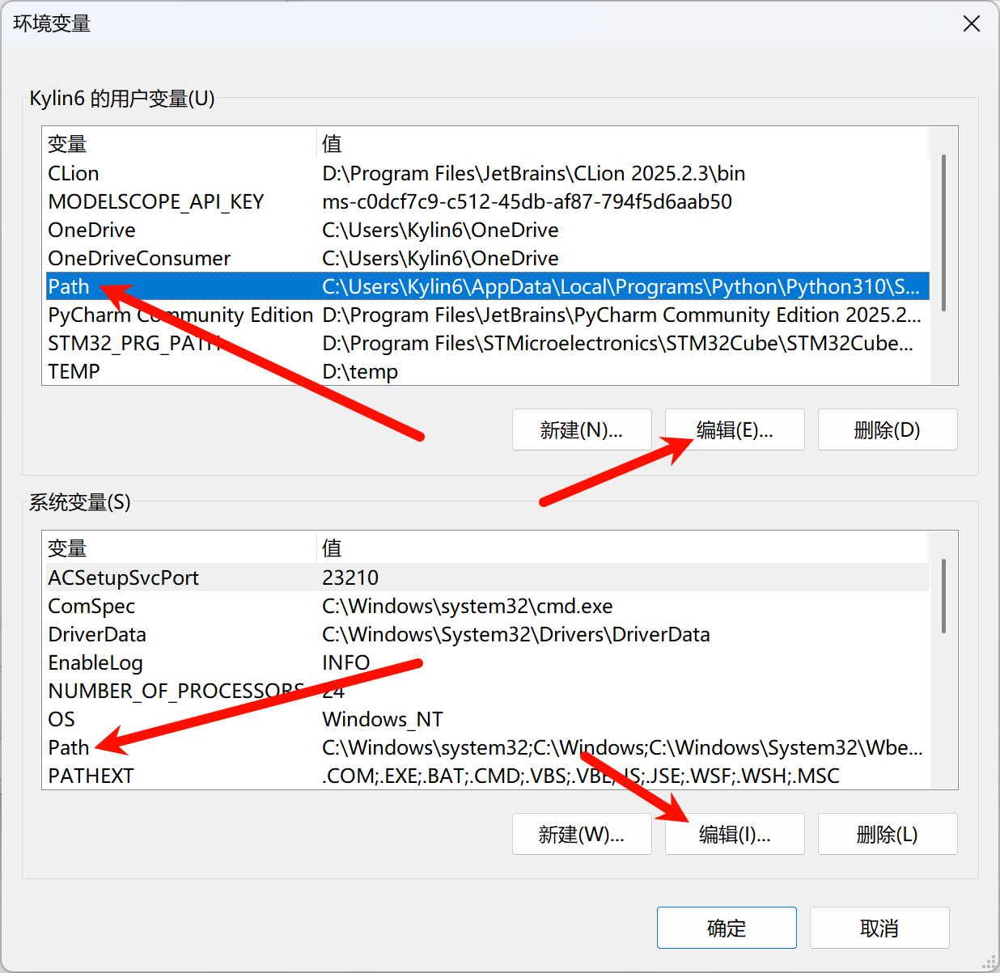
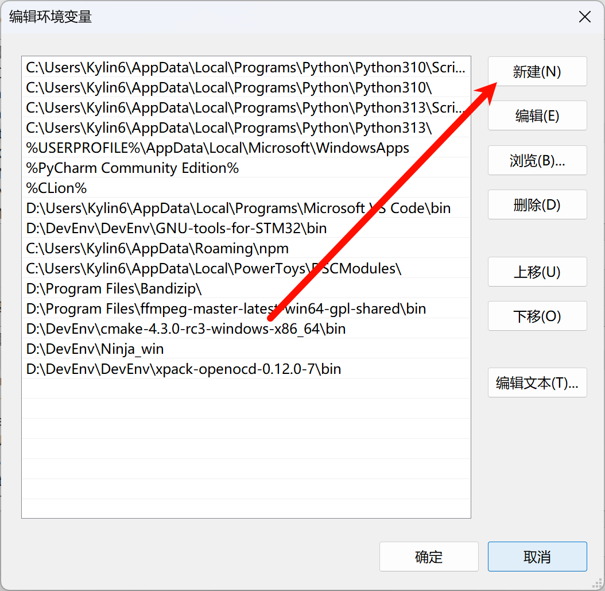
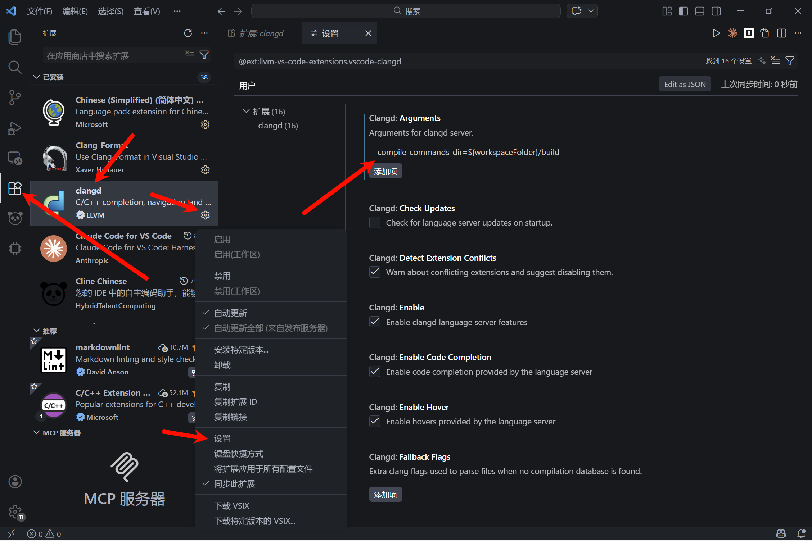
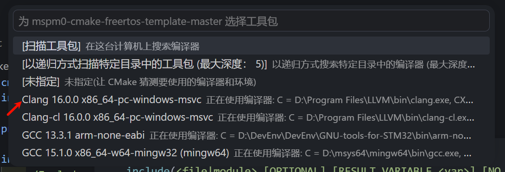
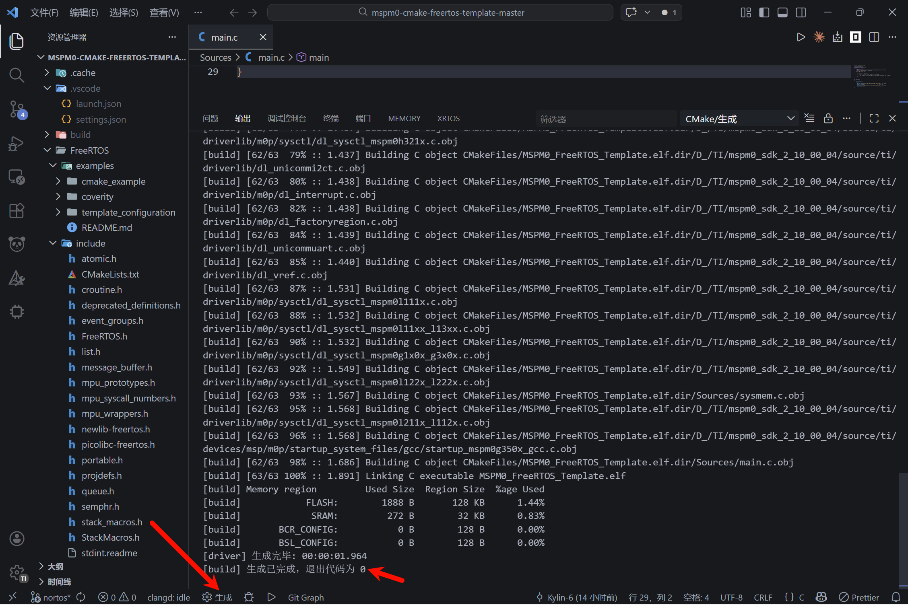
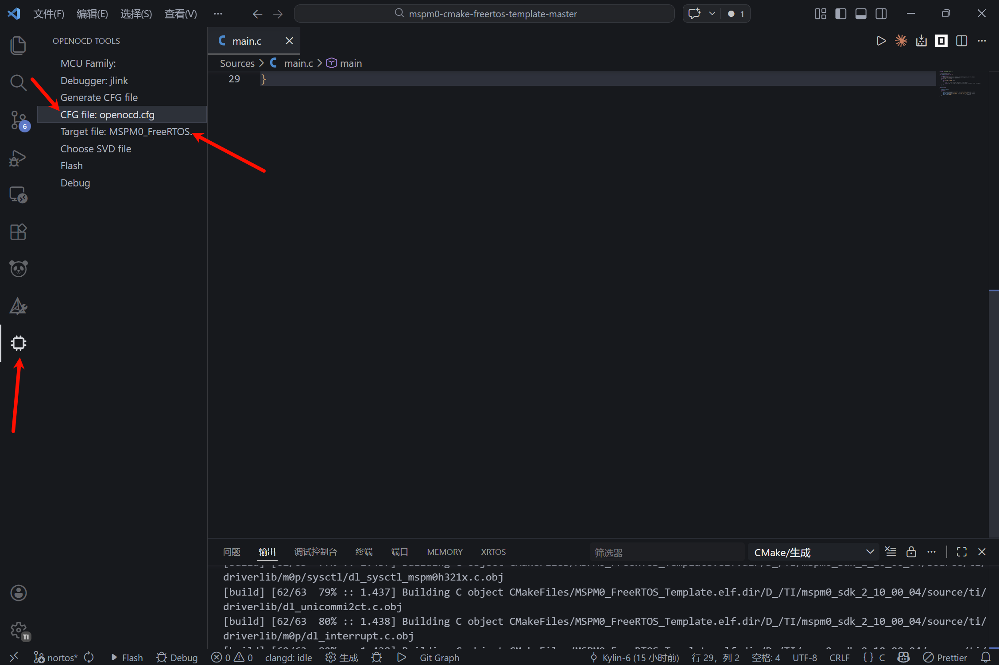
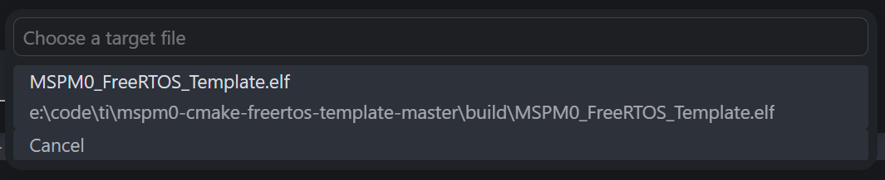
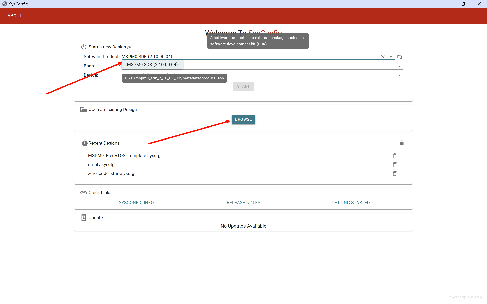
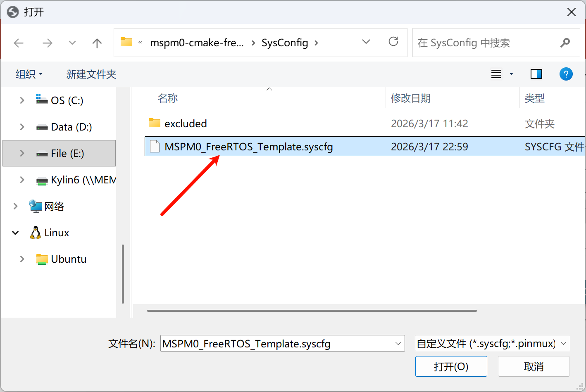

# TIMSPM0G3507+Cmake+Clangd开发一篇通

## 一. 五件套

- Cmake
- Ninja
- Clangd
- arm-none-eabi-gcc
- openocd

### 1.安装Cmake
- 链接 https://github.com/Kitware/CMake/releases/

- 下载好之后，放到一个稳定的路径下，来到`bin`目录下复制路径，添加到环境变量，类似这样
- ```
  D:\DevEnv\cmake-4.3.0-rc3-windows-x86_64\bin
  ```
- 配置环境变量应该不用教了吧
- 在windows高级系统设置里找到环境变量
- 找到



### 2.安装ninja
- 链接 https://github.com/ninja-build/ninja/releases/
- 同样的把有exe可执行文件的文件夹添加到环境变量

### 3.安装Clangd
- 链接 https://github.com/llvm/llvm-project/releases/
- 安装好会自动添加到环境变量，若自动添加环境变量失败可手动寻找bin手动添加

### 4.安装arm-none-eabi-gcc

- 开发过stm32的大概率已经有了，可以在终端试试。`arm-none-eabi-gcc --version`
- 链接 https://developer.arm.com/downloads/-/gnu-rm
- 同样的添加到环境变量

### 5.安装openocd

- 链接 https://github.com/xpack-dev-tools/openocd-xpack/releases
- 同样的添加到环境变量
- ***要注意openocd版本，0.12版本以上才支持ti的芯片***
- PS 根据keysking的clion配置教程的openocd版本不支持ti

#### PS：验证是否添加环境变量起效（win+x+i打开终端）

```
cmake --version
```

```
ninja --version
```

```
clangd --version
```

```
arm-none-eabi-gcc --version
```
```
openocd --version
```

### 6.安装ti的环境

#### 1. MSPM0-SDK
-  链接 https://www.ti.com/tool/MSPM0-SDK#downloads
#### 2. SYSCONFIG
-  链接 https://www.ti.com.cn/tool/cn/SYSCONFIG
-  类似于这样，建议安装到一起
- ```
  "D:\TI\mspm0_sdk_2_10_00_04"
  "D:\TI\sysconfig_1.27.0"
  ```
## 二.安装vscode和Git

- 传送：[`vscode`下载传送门](https://code.visualstudio.com/download#)，选择`system installer x64`版本下载并进行安装，位置任意选择。
- 传送：[Git - 下载软件包](https://git-scm.com/downloads/win)

​	打开`vscode`，在插件市场搜索以下对应的插件

- clangd

- Chinese (Simplified) (简体中文)

- Clang-Format（规范格式）

- CMake Tools

- openocd-tools

### Clang-Format（规范格式）(可选)
-  参考 https://www.bilibili.com/video/BV1LoijexEEF/?spm_id_from=333.337.search-card.all.click&vd_source=d4480637f8ff7e49fac6f81739bb5a2f

## 三.vscode以及cmake的配置

### 1.clangd的设置
- 找到
- 

- 添加 `--compile-commands-dir=${workspaceFolder}/build`

- 若安装了微软官方C/C++插件，右下角会弹出intellisense冲突，直接点击disable

### 2.项目结构
-使用git或者其他方式拉取本项目
```
MSPM0-CMAKE-GCC-TEMPLATE/
├── .cache/                 # 构建缓存（自动生成）
├── .vscode/                # VS Code 配置（如 launch.json, settings.json 等）
├── build/                  # build目录
├── FreeRTOS/               # RTOS支持文件
├── Sources/                # main.c等文件
├── SysConfig/              # ti的SysConfig以及依赖文件
├── .gitignore              # Git 忽略规则
├── CMakeLists.txt          # 顶层 CMake 构建配置
├── mspm0g350x_base.cmake   # Cmake源文件
├── README.md               # 项目说明文档
├── openocd.cfg             # openocd文件
├── Includes/               # 头文件等
```
### 3. 配置
- **打开mspm0g350x_base.cmake**
- 在大约40行附近，修改你电脑tim0sdk的实际路径
```
# 设置SDK路径
#######################
set(SYSCONFIG_PATH  ${CMAKE_SOURCE_DIR}/SysConfig)

# 这一行要看你用SDK的安装路径去更改，改成你用的SDK的路径
set(MSPM0_SDK_PATH "D:/TI/mspm0_sdk_2_10_00_04")

#######################
```


### 4. 使用
- 使用vscode打开项目文件夹，并且注意切换对应项目文件夹

- 若cmake弹出工具包选择，

- 

- 等待cmake自动配置完成

- 

- 若退出代码为0即为正常编译

### 5. openocd的使用

- 打开openocd tool

- 

- 因为不是stm32工程，无法自动识别ti的芯片，无需理会前三行，不要选择其他debugger然后点击Generate,使用ti的芯片建议手动写cfg文件

- 点开CFG file 选择该工作区目录下的openocd.cfg

- 点开Target file 若编译成功则会生成elf文件直接选择

- 

- 连接板子与daplink，点击右下角flash，等待烧录成功

### 5. ti sysconfig的使用

- 手动打开ti sysconfig

- 先选择sdk

- 

- 找到路径下的sysconfig

- 

- 剩下sysconfig使用教程参考网上

## 四.可能存在的问题

### 1.代码爆红

- 如果clangd配置好之后代码依然爆红（vscode语法提示错误）

- 请按下ctrl+shift+p，输入clangd，找到clangd: Restart Language Server，使用鼠标点击，或者使用键盘上的方向键选中后按下回车，此时你的代码应该就不会爆红了，而且代码提示和跳转也会恢复正常.

